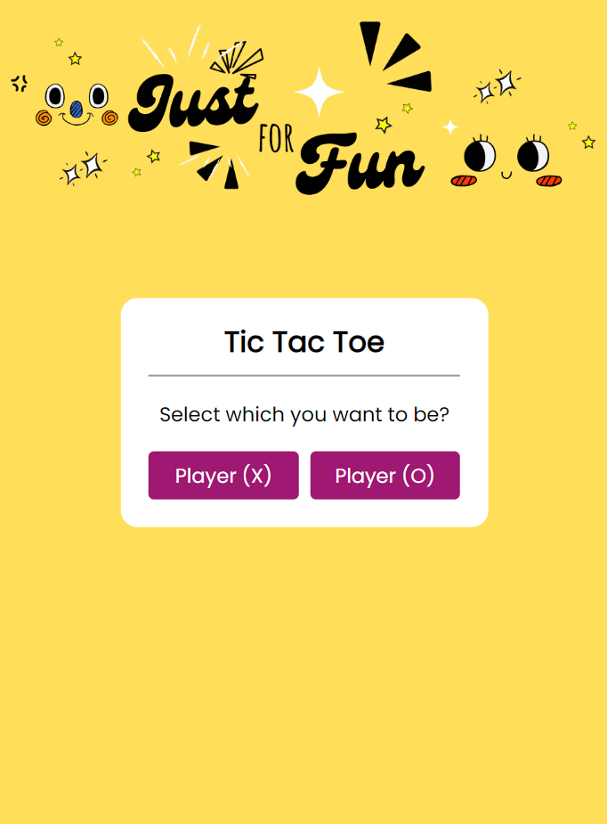
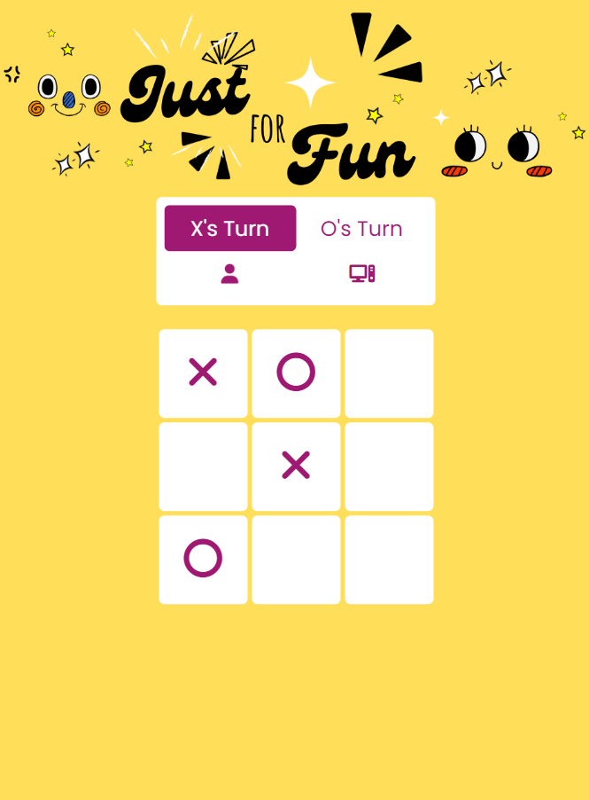
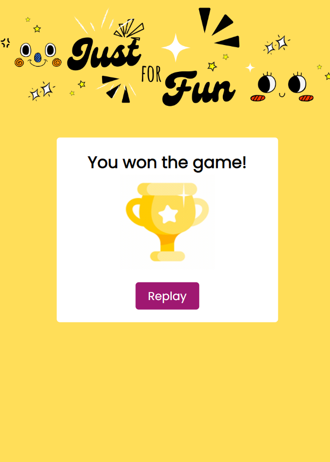

# Tic Tac Toe Game


## Description

This is a simple implementation of the classic Tic Tac Toe game using HTML, CSS, and JavaScript. The game is played in a web browser.

## Features

- Player vs. Computer mode
- Interactive game board
- Win and draw conditions detection

## How to Play

1. Clone the repository to your local machine:

   ```bash
   git clone https://github.com/ADHDilsithmi/Tic-Tac-Toe.git

2. Navigate to the project directory:

   ```bash
   cd tic-tac-toe

3. Open the index.html file in a web browser.

4. Follow the prompts to take turns and play the game.

## Screenshots

<table style="border-collapse: collapse; border: 2px solid black;">
  <tr>
    <td style="border: 1px solid black; padding: 10px;" align="center">
      
    </td>
    <td style="border: 1px solid black; padding: 10px;" align="center">
      
    </td>
    <td style="border: 1px solid black; padding: 10px;" align="center">
      
    </td>
  </tr>
</table>

## Technologies Used

<p align="left">
  <a href="https://www.w3.org/html/" target="_blank" rel="noreferrer">  </a> 
  <a href="https://developer.mozilla.org/en-US/docs/Web/JavaScript" target="_blank" rel="noreferrer">  </a>
</p>


   
